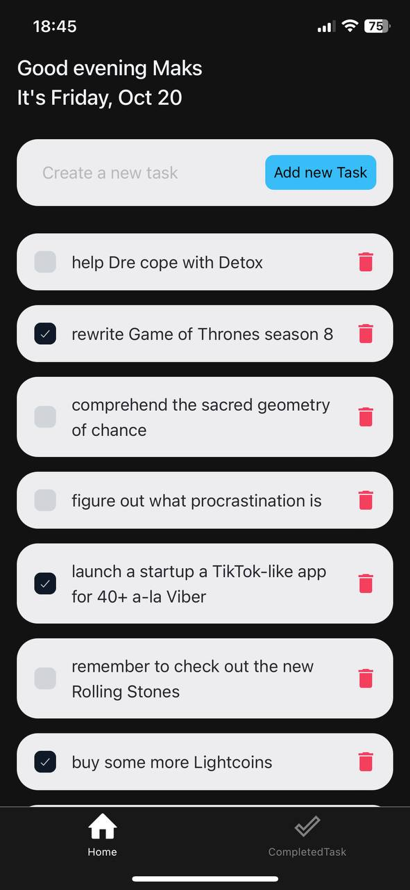
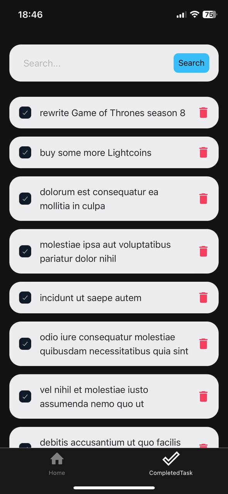

# Wokneerik TODO App

Beautiful and convenient application for managing your personal tasks

## Features

List the key features of your project.

- It's beautiful
- Simplicity
- Convenience
- Absolutely carbon neutral

## Screenshots




### Prerequisites

- Yarn
- Expo CLI

### Installation

1. Clone the repository:

   ```bash
   git clone https://github.com/yourusername/your-project.git
   ```
